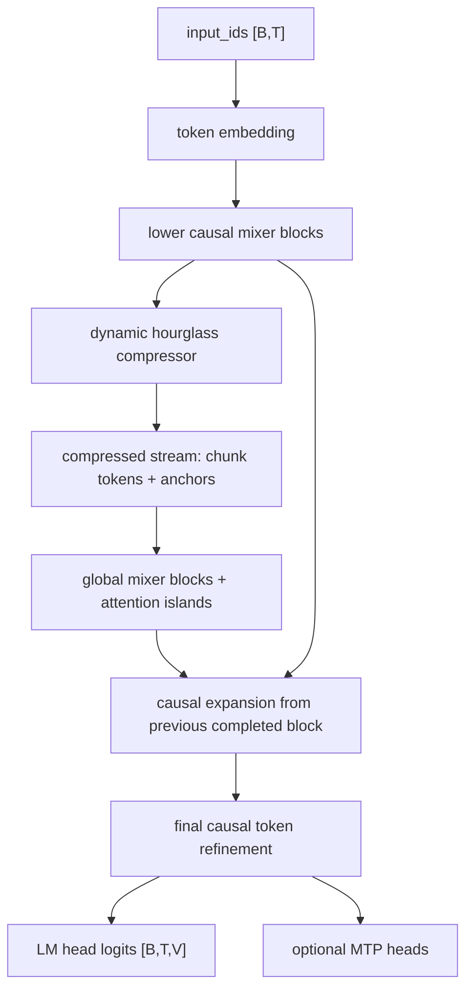

# RAAM-LM Design

RAAM-LM is a decoder-only causal language model prototype that tries to spend exact attention on a compressed global stream while preserving token-level detail through a local path. The design is meant to be falsifiable: it should be easy to compare against dense Transformer and pure mixer baselines under matched tokenizer, data order, optimizer, token budget, FLOP budget, and context length.

RAAM-AgentCoder is the scratch-training specialization of this architecture for chat-first agentic software engineering. Architecturally it is still a causal LM, but the tokenizer, dataset format, curriculum, evals, and Vast readiness scripts are shaped around repository reasoning, patch generation, stack trace debugging, test-driven repair, tool-call transcripts, and code review.

## Mechanism Card

| Field | Description |
| --- | --- |
| Core idea | Keep a cheap causal token backbone, compress completed blocks into a global stream, preserve learned anchors, and place exact attention in a few upper layers. |
| Bottleneck targeted | Full-sequence attention cost and memory growth at longer context. |
| Architecture mechanism | Lower causal mixer blocks, fixed-shape block compression, delayed chunk latents, preserved anchors, compressed-stream attention islands, causal expansion, final token refinement, optional MTP. |
| Complexity | Cheap mixer path is near-linear in sequence length; attention islands operate on compressed length. |
| Memory behavior | Compressed attention stores fewer sequence states, but anchor selection and reconstruction add overhead. |
| Claimed results | None yet. |
| Weaknesses | Compression may discard rare details, learned top-k anchors may hurt hardware regularity, and fallback mixer is not true Mamba. |
| Closest prior work category | Efficient sequence mixers, token pruning/compression, hierarchical sequence models, MTP-style auxiliary objectives. |
| Novelty risk | High; the prototype combines known categories and should be evaluated as an engineering hypothesis. |
| Implementation difficulty | Moderate; the hard part is causal correctness through compression and routing. |
| Experiment to falsify | Compare loss, probes, throughput, and FLOPs against matched baselines; reject the idea if gains vanish under fair matching. |

## Dataflow

## Causal Strategy

The local token path uses causal convolutional mixers. The compressed stream assigns every compressed token a causal origin and exact attention uses an origin-based causal mask. Chunk latents summarize a completed block, but token expansion only uses the previous completed block's chunk state for the current block. Current-block anchors are present in the global stream for later context, but they are not scattered into current-block logits because their learned top-k selection depends on the whole block.

Delayed chunk context is needed because a chunk latent summarizes all tokens in its block. Without delay, positions inside the same block could receive information from later positions through the chunk.

## Anchors

Anchors preserve individual high-scoring token states in the compressed stream. This is intended to reduce over-compression of names, numbers, punctuation, code-like delimiters, or rare spans. The debug implementation uses learned scores and fixed top-k anchors per block for static shapes. Heuristic boosts are represented in the config but left off by default.

## Attention Islands

Attention islands are exact causal SDPA blocks placed only in selected upper global layers. They are meant to provide content-based retrieval capacity without paying dense attention cost at every token layer.

## MTP

Curriculum multi-token prediction is an add-on objective. It shares the trunk and turns on horizons gradually. It should be ablated separately because it can change optimization and calibration independently of the core architecture.

## Known Failure Modes

- Compression destroys rare details.
- Attention islands are too few to restore retrieval.
- The fallback mixer is not true Mamba.
- Dynamic top-k anchor selection may hurt hardware performance.
- MTP may harm next-token calibration.
- Apparent wins may vanish under FLOP matching.
- Agentic behavior may fail to emerge from small scratch runs without enough high-quality repository/edit/test traces.
- The no-anchor variant may win cheap next-token loss while losing rare-token or long-context code retrieval.

## Hardware Notes

- Debug and scale configs use static sequence lengths and fixed anchors per block.
- Exact attention uses `torch.nn.functional.scaled_dot_product_attention`.
- The hot path uses dense matmuls, SDPA, depthwise convolution, and fixed-shape gather/scatter.
- No custom CUDA is required.
- `torch.compile` is not required.
- Wall-clock and memory are measured by the profiling script; FLOPs are approximate and documented as estimates.
